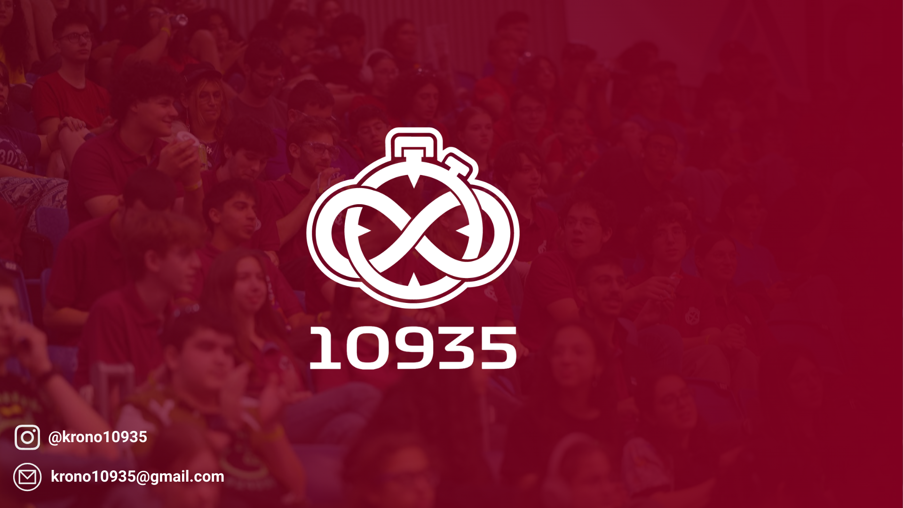
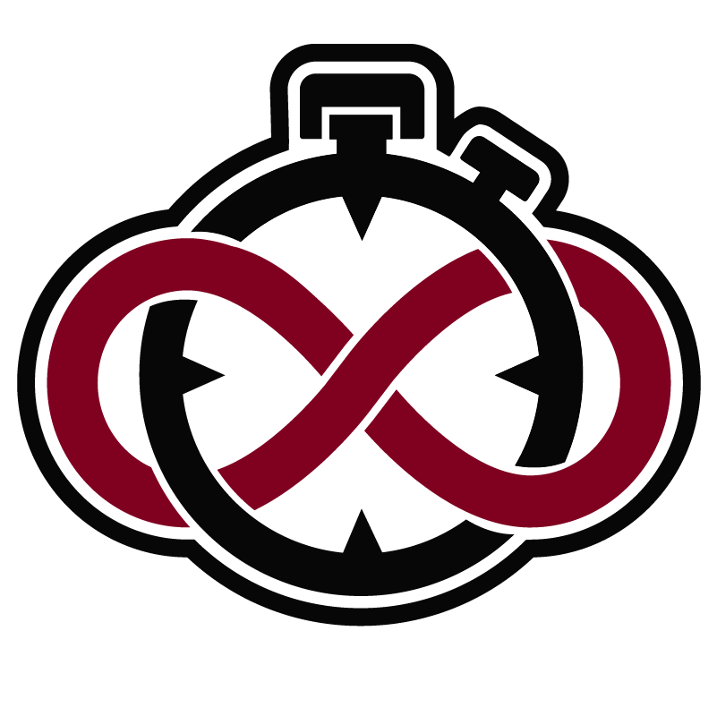
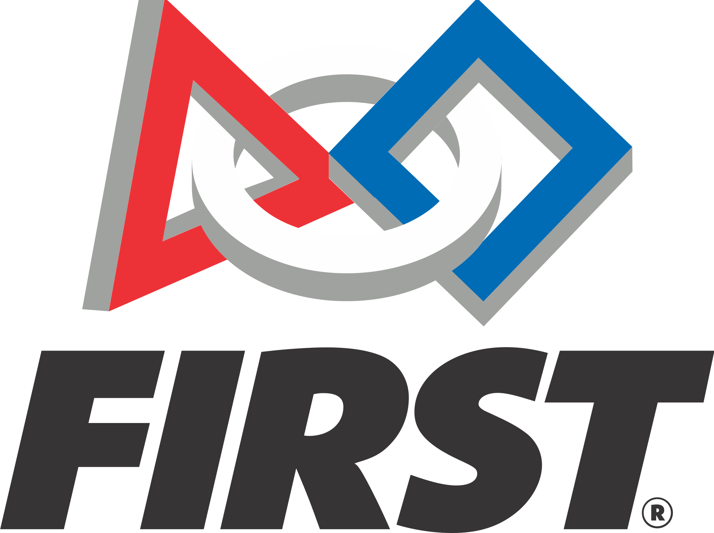

<!--🖼️Top Banner ->

-->

  

<!--🖼️Logo and About--> 

<h2><a href="To come">Who are we?</a></h2>

    

    We are Krono#10935 group from Kiryat Ono. Our group takes part in the various programs of the world FIRST organization. In our complex other groups operate in the other programs FRC, FLL. In addition, our group works for the community, using the knowledge we acquired with the help of the program and with the aim of spreading our vision FIRST For Everyone.

<!--🤖FIRST Robotics Organization-->

<h2><a href="https://www.firstinspires.org/">What is FIRST Robotics?</a></h2>

  
  

    FIRST Robotics is a non-profit organization founded by inventor Dean Kamen in 1989 to inspire young people's interest and participation in science and technology. FIRST stands for "For Inspiration and Recognition of Science and Technology". The organization hosts several robotics competitions each year for students from around the world to demonstrate their engineering and problem-solving skills. 
  

